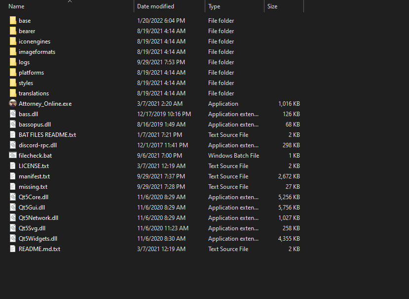
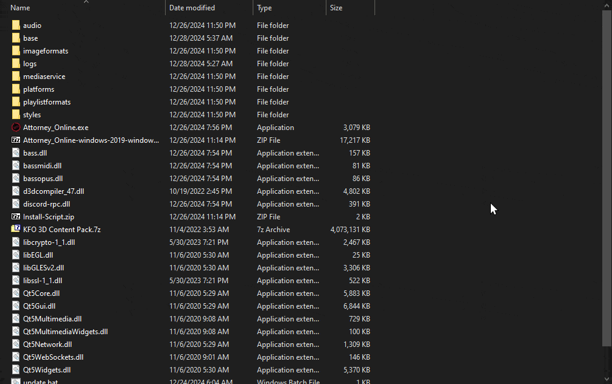

# Downloads

There are multiple options for you to install content to join KFO. While all of the content combined weighs a lot, you can choose to download only specific parts of what you'd need.

## 💻Downloading the Program

The program is essential! We are using is called the Killing Fever Online Client (KFO Client for short). This is what's used for joining the server and taking part in roleplays.

### ***🌟Download the [latest KFO Client!](https://github.com/Crystalwarrior/KFO-Client/releases/latest) (click the link)***

However, before being able to roleplay, each roleplay may request you to download **specific content**. Killing Fever Online provides its own content for you to download and interact with that any roleplay hosts may use as they see fit.

This tutorial video has everything you need to help you get started!

[Tutorial Video](https://youtu.be/-YGvxjU91Rk)
<iframe width="560" height="315" src="https://www.youtube.com/embed/-YGvxjU91Rk?si=YVF_O3VWUSMKYUiN" title="YouTube video player" frameborder="0" allow="accelerometer; autoplay; clipboard-write; encrypted-media; gyroscope; picture-in-picture; web-share" referrerpolicy="strict-origin-when-cross-origin" allowfullscreen></iframe>

Unfortunately, the program is not yet capable of downloading anything for you - therefore, you must download and install all the content used by the program yourself. The instructions below will aim to make this process as painless as possible.

## 🧳Installing the Content

Each content pack comes as an Archive file, which you can find in the **Content Downloads** section. To install it:

1. Open the archive in [7-Zip](https://www.7-zip.org/) or [WinRAR](https://www.win-rar.com/start.html?&L=0)
2. If the archive contains just the "base" folder, put the folder into the 
same directory as the .exe and replace anything it asks you to replace.

Helpful gif:

If the folder does not contain a "base" folder, or the folder is named something else (e.g. base_3D), you can install it as an asset pack instead. To do so:

1. Extract it into the same folder as your .exe (optional - you can extract it anywhere but it's convenient to put it in the same place)
2. Launch the Program
3. Open the Settings screen
4. Navigate to Assets tab
5. Click "Add..."
6. Select the folder you just extracted!

Helpful gif:

## 📥Content Downloads

### 🤏Minimal Download

Last updated: 25-Dec-25

This is the minimal download you need to join the server. Includes:
* backgrounds
* sound files
* characters (besides 3D ones)
* evidence

Does _NOT_ include:
* 3D Characters
* Music

[📦Download Here!](https://drive.google.com/open?id=1W4FospCaoHM6L5MUCp0hySIb8bk73of-&usp=drive_fs)

---

### 🔊Music Pack

Last updated: 25-Dec-25

This is all the music used by the server. Includes a massive assortment of songs from various franchises!

[📦Download Here!](https://drive.google.com/file/d/1mlzgqcYrcg-TymCt-Uyrub-QqZ0zQlyY/view?usp=sharing)

---

### 🧊3D Characters Pack

Last updated: 25-Dec-25

This includes the heavy-weight 3D Characters used by KFO from games such as Ace Attorney: Dual Destinies, Spirit of Justice, Dai Gyakuten Saiban, etc.!

[📦Download Here!](https://drive.google.com/open?id=1cztYe5miC4eSga01xL2wZZLM2w9gZtq-&usp=drive_fs)

---

## Frequently Asked Questions (F.A.Q.)

**Question**: Do I really need to download anything other than the Miminal Download to roleplay if I intend to use custom files?

**Answer**: Nope! A lot of weekly RPs on KFO use custom files and often even provide their own content independent of KFO. Ask your Game Master to assist you with downloading content.

---

**Question**: I can't hear any music!

**Answer**: Make sure your Music Pack is installed. To double-check, make sure the music is located in base/sounds/music folder in your program!

---

**Question**: I see a missing character!

**Answer**: Ask the person who you're missing if they're using a 3D Character, or a Custom Download. If they're a 3D character, you should install the 3D Characters Pack. Otherwise ask them for their custom character download.

---

**Question**: I can't see any backgrounds!

**Answer**: Make sure the Minimal Download is installed. Otherwise, ask your Game Master (GM) if you're missing their custom files.

## Updates Archive

You can access the historical archive of past updates [Here](archive.md).